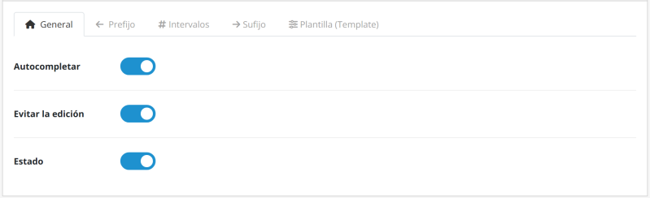
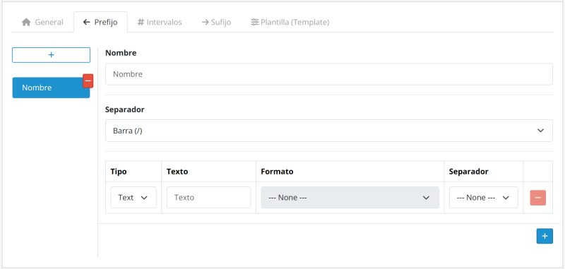
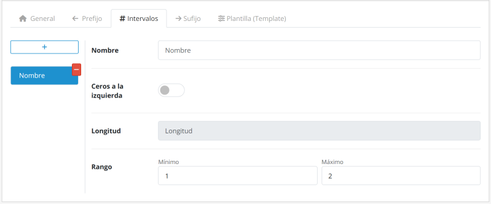
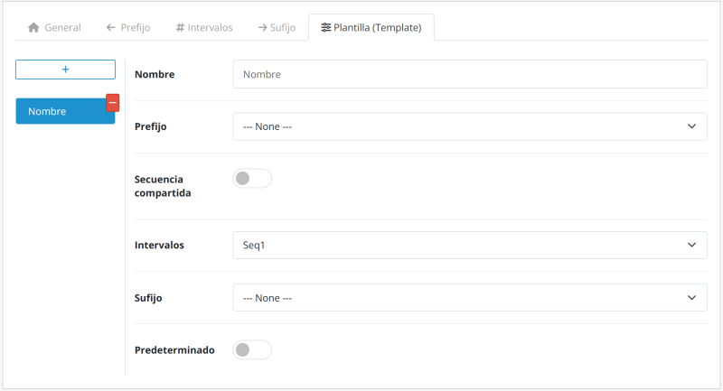
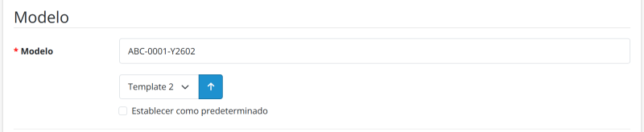

# Model Number Generator for OpenCart 3.x / 4.x

[English](README.md) | [Português (BR)](README.pt-br.md) | [Português (PT)](README.pt-pt.md) | [Español](README.es-es.md) | [Français](README.fr-fr.md) | [Italiano](README.it-it.md)

Documentación de la extensión Model Number Generator para OpenCart 3.x / 4.x. Genera automáticamente números de modelo de productos estructurados. Disponible en versiones Free y Pro. Licenciada bajo GPL-3.0.

---

## Acerca del módulo

### Descripción general

Elimine el trabajo manual y repetitivo al crear códigos de identificación de productos.

El módulo garantiza identificadores **únicos y estandarizados** mediante un sistema inteligente de plantillas. Con esta solución, puede reducir los errores humanos y los duplicados, estableciendo una estructura lógica y escalable para un mejor control del inventario.

#### Requisitos

Asegúrese de tener permisos para acceder a:

- Extension Installer & Manager
- Product Catalog

#### Comparación de versiones

| Función | Free | Pro |
|---|:---:|:---:|
| Bloquear el campo Model | ❌ | ✅ |
| Plantillas | Solo 1 | Ilimitadas |
| Intervalos numéricos | Solo 1 | Ilimitados |
| Prefijos | ❌ | Ilimitados |
| Sufijos | ❌ | Ilimitados |

---

### Funciones principales

| Función | Descripción |
|:---|:---|
| **Autocompletado inteligente** | El sistema identifica la plantilla predeterminada y completa automáticamente el campo **Model** al abrir un nuevo formulario, ahorrando tiempo y clics. |
| **Seguridad y unicidad** | Garantiza un **identificador único** para cada producto, evitando números duplicados, y puede bloquear el campo **Model** para impedir modificaciones manuales y reducir errores humanos. |
| **Procesamiento retroactivo** | Estandarice de forma segura los productos existentes de la tienda. El módulo genera y aplica números de modelo a sus productos actuales. |
| **Plantillas dinámicas** | Combine prefijos, intervalos y sufijos para crear reglas distintas por departamento o categoría de producto. |
| **Interfaz multilingüe** | Interfaz intuitiva con traducciones nativas disponibles en inglés (EN), portugués (PT), francés (FR), español (ES) e italiano (IT). |
| **Escalabilidad total** | Gestione múltiples reglas simultáneamente sin pérdida de rendimiento en bases de datos grandes. |

---

## Estructura del número de modelo

La generación de códigos es modular y flexible, dividida en tres componentes que garantizan una trazabilidad y unicidad completas.

**Ejemplo de estructura:**

`ABC-XYZ-0001-ASD-QWE`

| Componente | Tipo | Ejemplo |
|---|---|---|
| **Prefijo** | Identificador macro | `ABC-XYZ-` |
| **Secuencial** | Núcleo numérico | `0001` |
| **Sufijo** | Atributos finales | `-ASD-QWE` |

### Prefijos

Identificadores macro que preceden al número secuencial (por ejemplo, `ABC-XYZ-`).

- **Modular**: Se divide en varios bloques.
- **Escalable**: Añada tantos bloques como desee.
- **Opcional**: Utilícelo solo cuando sea necesario.
- **Conexión**: Requiere un separador antes del número secuencial.

### Intervalo numérico

El núcleo secuencial obligatorio (por ejemplo, `0001`) que garantiza la unicidad.

- **Relleno con ceros**: Añade ceros a la izquierda hasta alcanzar la longitud configurada.
- **Variable**: Longitud de dígitos personalizable.
- **Rangos**: Reglas e intervalos específicos por categoría.

### Sufijos

Atributos finales utilizados para detallar versiones o estados (por ejemplo, `-ASD-QWE`).

- **Modular**: Se divide en varios bloques.
- **Escalable**: Añada tantos bloques como desee.
- **Opcional**: Utilícelo solo cuando sea necesario.
- **Conexión**: Requiere un separador antes del número secuencial.

---

### Atención: sensibilidad a los separadores

El sistema procesa cada carácter literalmente, vinculando el intervalo numérico a la combinación única de prefijos, sufijos y separadores. **Cualquier cambio —como sustituir un guion (`-`) por una barra (`/`)— define una nueva identidad**, reiniciando automáticamente la secuencia numérica para ese identificador específico.

- **Patrón de referencia**: `ABC-XYZ-0001-ASD-QWE`
- **Patrón diferente**: `ABC/XYZ-0001-ASD-QWE` *(La barra modifica el prefijo; el contador se reinicia para este nuevo grupo.)*

---

### Consejo de estandarización

Para mantener la legibilidad en etiquetas e informes, utilice acrónimos cortos para representar categorías o marcas.

- **Recomendado**: `HW-MEM-DDR4-001` *(Hardware - Memory - DDR4)*
- **Evitar**: `HARDWARE-MEMORY-DDR4-001`

---

## Instalación

Siga el flujo de trabajo siguiente para aplicar la numeración automática a sus productos:

1. **Descarga**: Obtenga el módulo oficial directamente desde el [OpenCart Marketplace](https://www.opencart.com/index.php?route=marketplace/extension&filter_member=Rodrigoabr).
2. **Carga**: En el panel de administración de su tienda, vaya a **Extensions > Installer**, haga clic en **Upload** y seleccione el archivo descargado.
3. **Activación**: Localice el módulo en la lista de extensiones y haga clic en el icono **Install** para activarlo.

> **Consejo técnico**: Después de la activación, recuerde ir a **Extensions > Modifications** y hacer clic en el botón **Refresh** (icono azul) para limpiar la caché del sistema.

---

## Acceso a la configuración

Después de la instalación, siga este flujo de trabajo para configurar la automatización:

1. Vaya a **Extensions > Extensions** en el menú lateral.
2. Seleccione el tipo de extensión **Modules**.
3. Haga clic en **Edit** para abrir el panel de configuración.

---

### 1. Configuración general

| Parámetro | Función |
|---|---|
| **Autocompletado** | Genera la plantilla al instante al crear productos. |
| **Impedir edición** | Bloquea el campo **Model** para evitar cambios manuales. |
| **Estado** | Activa o desactiva el módulo. |

---

### 2. Prefijo y sufijo

Estas pestañas permiten componer los elementos de texto o fecha que rodean al número secuencial.

#### Configuración del grupo

| Parámetro | Función |
|---|---|
| **Nombre** | Identificación interna (por ejemplo, Electronics, Apparel). |
| **Separador** | Carácter que une este grupo al número secuencial. |

#### Composición de elementos

| Parámetro | Descripción |
|---|---|
| **Tipo** | Define si el elemento será **Fixed Text** o una **Dynamic Date**. |
| **Contenido (texto)** | Valor textual que se mostrará (por ejemplo, `PROD`). |
| **Formato (fecha)** | Patrón de fecha deseado (por ejemplo, año de 2 dígitos + mes). |
| **Separador** | Carácter que une este elemento con el siguiente dentro del mismo grupo. |

> **Consejo**: Puede añadir varios elementos para crear prefijos complejos, como `YEAR-CATEGORY-`.

---

### 3. Intervalo secuencial

| Parámetro | Descripción |
|---|---|
| **Nombre** | Identificación interna (por ejemplo, General Count, Batch 2024). |
| **Longitud** | Define el número mínimo de dígitos mediante el relleno con ceros (por ejemplo, una longitud de 4 transforma `1` en `0001`). |
| **Mín. / Máx.** | Define el punto inicial y el límite final del contador. |

> **Consejo**: Si trabaja con variaciones (como color o talla), utilice la opción **Shared Sequence** en la pestaña **Template** para mantener una única secuencia para todos los productos.

---

### 4. Plantilla

La plantilla es donde se "unen" las configuraciones anteriores.

| Parámetro | Descripción |
|---|---|
| **Nombre** | Identificación interna (por ejemplo, Mouse, Keyboard, A4 Sheets). |
| **Prefijo** | Se vincula al grupo de **Prefix** configurado. |
| **Shared Sequence** | Permite que diferentes variaciones de producto compartan la misma secuencia numérica. |
| **Intervalo** | Se vincula a la regla de **Sequential Interval** configurada. |
| **Sufijo** | Se vincula al grupo de **Suffix** configurado. |
| **Predeterminada** | Establece la plantilla como principal para el **auto-fill**. |

> **Consejo de flujo de trabajo**: Asegúrese de haber creado los grupos Prefix, Interval y Suffix antes de finalizar este paso.

---

### Secuencia compartida

La opción **Shared Sequence** permite que diferentes variaciones de un producto (como color, talla o versión) compartan la **misma secuencia numérica**, incluso si tienen sufijos distintos.

Cuando está activada, el sistema ignora el sufijo al calcular el siguiente número disponible y considera únicamente el **prefijo**.

- **Prefijo**: `TSHIRT-`
- **Número**: `001`
- **Sufijo**: `-WHT` / `-BLK`

#### Comparación de comportamiento

| Modo | Comportamiento | Ejemplo de resultado |
|---|---|---|
| **Desactivado** | Cada sufijo tiene su propia secuencia | `TSHIRT-001-WHT` `TSHIRT-002-WHT` `TSHIRT-001-BLK` `TSHIRT-002-BLK` |
| **Activado** | Secuencia unificada para todas las variaciones por prefijo | `TSHIRT-001-WHT` `TSHIRT-002-WHT` `TSHIRT-003-BLK` `TSHIRT-004-BLK` |

- **Cuándo utilizarlo**: Variaciones de color, talla y versiones de productos.
- **Importante**: El número debe aparecer inmediatamente después del prefijo. Las estructuras diferentes pueden impedir la correcta identificación de la secuencia.

---

## Generación de números

Siga el flujo de trabajo siguiente para aplicar la numeración automática a sus productos:

1. **Navegación**: En el menú lateral, vaya a **Catalog > Products**.
2. **Acceso**: Haga clic en **Edit** en el producto o en el botón **Add New**.
3. **Ubicación**: Vaya a la pestaña **Data** y localice el campo **Model** en el formulario.
4. **Generar número**: Seleccione la plantilla y haga clic en el botón **Generate**. El campo **Model** se rellenará.

> **Consejo de comodidad**: Al seleccionar una plantilla que no sea la predeterminada y marcar la opción **Set as default**, el sistema guardará automáticamente su elección al generar el número.

---

## Desinstalación

Siga los pasos siguientes para realizar una desinstalación limpia y segura:

1. **Desinstalar**: Vaya a **Extensions > Extensions**, filtre por **Modules**, localice el módulo y haga clic en **Uninstall**.
2. **Eliminar**: Localice el módulo en la lista de extensiones instaladas y haga clic en el icono **Delete**.

> **¿Qué ocurre con los datos?**: La desinstalación elimina la configuración y los archivos del módulo. Sin embargo, los **números de modelo ya generados** para sus productos permanecen almacenados en la base de datos para evitar la pérdida de integridad de sus registros.

---

## ¿Disfruta del módulo?

Si el módulo le está ayudando a optimizar su catálogo, considere invitar a un café al autor. Esto ayuda a mantener el desarrollo, el mantenimiento y las futuras actualizaciones.

---

### Soporte y licencia

Obtenga ayuda a través de la página oficial del Marketplace: [Obtener soporte](https://www.opencart.com/index.php?route=marketplace/extension&filter_member=Rodrigoabr).

---

## Información de licencia

Esta extensión (versiones Free y Pro) está licenciada bajo la **GNU General Public License v3.0 (GPL-3.0)**.

- El uso y la modificación del software deben cumplir los términos establecidos por la licencia GPL-3.0.
- El soporte técnico y las actualizaciones se proporcionan exclusivamente a los compradores originales a través del OpenCart Marketplace oficial.
- Para consultar todos los detalles de la licencia, consulte el [archivo LICENSE](https://github.com/ab-rodrigo/model-number-generator-docs/blob/main/LICENSE) incluido en este repositorio o visite la página oficial de la [GNU General Public License v3.0](https://www.gnu.org/licenses/gpl-3.0.html).

---

© 2026 **Rodrigoab** · [OpenCart Extensions](https://www.opencart.com/index.php?route=marketplace/extension&filter_member=Rodrigoabr)