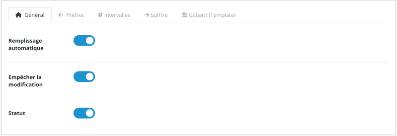
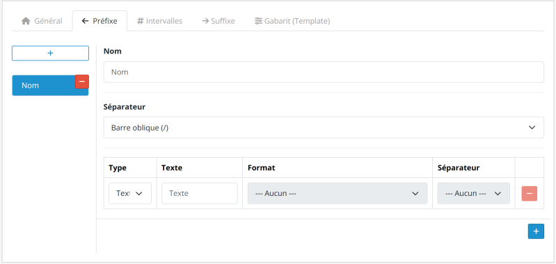
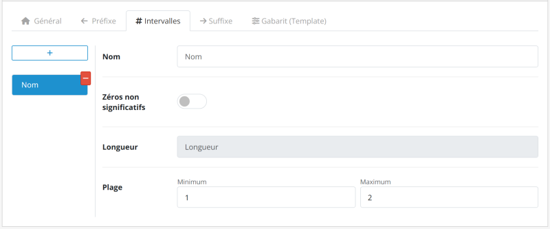
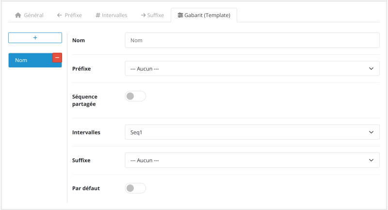
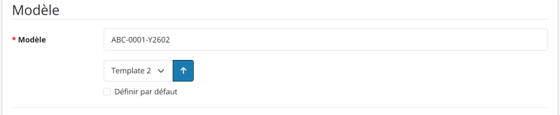

# Model Number Generator for OpenCart 3.x / 4.x

[English](README.md) | [Português (BR)](README.pt-br.md) | [Português (PT)](README.pt-pt.md) | [Español](README.es-es.md) | [Français](README.fr-fr.md) | [Italiano](README.it-it.md)

Documentation de l’extension Model Number Generator pour OpenCart 3.x / 4.x. Générez automatiquement des numéros de modèle structurés pour vos produits. Disponible en versions Free et Pro. Sous licence GPL-3.0.

---

## À propos du module

### Présentation

Éliminez le travail manuel et répétitif lors de la création des codes d’identification des produits.

Le module garantit des identifiants **uniques et standardisés** grâce à un système intelligent de modèles. Cette solution permet de réduire les erreurs humaines et les doublons tout en établissant une structure logique et évolutive pour un meilleur contrôle des stocks.

#### Prérequis

Assurez-vous de disposer des autorisations nécessaires pour accéder à :

- Extension Installer & Manager
- Product Catalog

#### Comparaison des versions

| Fonctionnalité | Free | Pro |
|---|:---:|:---:|
| Verrouillage du champ Model | ❌ | ✅ |
| Modèles | 1 seul | Illimités |
| Intervalles numériques | 1 seul | Illimités |
| Préfixes | ❌ | Illimités |
| Suffixes | ❌ | Illimités |

---

### Fonctionnalités principales

| Fonctionnalité | Description |
|:---|:---|
| **Remplissage automatique intelligent** | Le système identifie le modèle par défaut et remplit automatiquement le champ **Model** lors de l’ouverture d’un nouveau formulaire, ce qui permet de gagner du temps et des clics. |
| **Sécurité et unicité** | Garantit un **identifiant unique** pour chaque produit, évite les numéros en double et peut verrouiller le champ **Model** afin d’empêcher les modifications manuelles et de réduire les erreurs humaines. |
| **Traitement rétroactif** | Standardisez en toute sécurité les produits existants de votre boutique. Le module génère et applique des numéros de modèle à vos produits actuels. |
| **Modèles dynamiques** | Combinez préfixes, intervalles et suffixes pour créer des règles distinctes par service ou catégorie de produit. |
| **Interface multilingue** | Interface intuitive avec des traductions natives disponibles en anglais (EN), portugais (PT), français (FR), espagnol (ES) et italien (IT). |
| **Évolutivité complète** | Gérez plusieurs règles simultanément sans perte de performances dans les grandes bases de données. |

---

## Structure du numéro de modèle

La génération des codes est modulaire et flexible, divisée en trois composants qui garantissent une traçabilité et une unicité complètes.

**Exemple de structure :**

`ABC-XYZ-0001-ASD-QWE`

| Composant | Type | Exemple |
|---|---|---|
| **Préfixe** | Identifiant macro | `ABC-XYZ-` |
| **Séquentiel** | Noyau numérique | `0001` |
| **Suffixe** | Attributs finaux | `-ASD-QWE` |

### Préfixes

Identifiants macro qui précèdent le numéro séquentiel (par exemple, `ABC-XYZ-`).

- **Modulaire** : Divisé en plusieurs blocs.
- **Évolutif** : Ajoutez autant de blocs que nécessaire.
- **Optionnel** : Utilisez-le uniquement lorsque cela est nécessaire.
- **Connexion** : Nécessite un séparateur avant le numéro séquentiel.

### Intervalle numérique

Le noyau séquentiel obligatoire (par exemple, `0001`) qui garantit l’unicité.

- **Remplissage avec des zéros** : Ajoute des zéros à gauche pour atteindre la longueur configurée.
- **Variable** : Longueur des chiffres personnalisable.
- **Plages** : Règles et intervalles spécifiques par catégorie.

### Suffixes

Attributs finaux utilisés pour détailler les versions ou les statuts (par exemple, `-ASD-QWE`).

- **Modulaire** : Divisé en plusieurs blocs.
- **Évolutif** : Ajoutez autant de blocs que nécessaire.
- **Optionnel** : Utilisez-le uniquement lorsque cela est nécessaire.
- **Connexion** : Nécessite un séparateur avant le numéro séquentiel.

---

### Attention : sensibilité aux séparateurs

Le système traite chaque caractère littéralement et associe l’intervalle numérique à la combinaison unique des préfixes, suffixes et séparateurs. **Toute modification — comme le remplacement d’un trait d’union (`-`) par une barre oblique (`/`) — définit une nouvelle identité**, ce qui redémarre automatiquement la séquence numérique pour cet identifiant spécifique.

- **Modèle de référence** : `ABC-XYZ-0001-ASD-QWE`
- **Modèle différent** : `ABC/XYZ-0001-ASD-QWE` *(La barre oblique modifie le préfixe ; le compteur redémarre pour ce nouveau groupe.)*

---

### Conseil de standardisation

Pour conserver une bonne lisibilité sur les étiquettes et les rapports, utilisez des acronymes courts pour représenter les catégories ou les marques.

- **Recommandé** : `HW-MEM-DDR4-001` *(Hardware - Memory - DDR4)*
- **À éviter** : `HARDWARE-MEMORY-DDR4-001`

---

## Installation

Suivez le processus ci-dessous pour appliquer la numérotation automatique à vos produits :

1. **Téléchargement** : Téléchargez le module officiel directement depuis l’[OpenCart Marketplace](https://www.opencart.com/index.php?route=marketplace/extension&filter_member=Rodrigoabr).
2. **Importation** : Dans le panneau d’administration de votre boutique, allez dans **Extensions > Installer**, cliquez sur **Upload** et sélectionnez le fichier téléchargé.
3. **Activation** : Localisez le module dans la liste des extensions et cliquez sur l’icône **Install** pour l’activer.

> **Conseil technique** : Après l’activation, pensez à aller dans **Extensions > Modifications** et à cliquer sur le bouton **Refresh** (icône bleue) afin de vider le cache du système.

---

## Accès aux paramètres

Après l’installation, suivez ce processus pour configurer votre automatisation :

1. Allez dans **Extensions > Extensions** dans le menu latéral.
2. Sélectionnez le type d’extension **Modules**.
3. Cliquez sur **Edit** pour ouvrir le panneau de configuration.

---

### 1. Paramètres généraux

| Paramètre | Fonction |
|---|---|
| **Remplissage automatique** | Génère instantanément le modèle lors de la création de produits. |
| **Empêcher la modification** | Verrouille le champ **Model** afin d’empêcher les modifications manuelles. |
| **Statut** | Active ou désactive le module. |

---

### 2. Préfixe et suffixe

Ces onglets permettent de composer les éléments textuels ou de date qui entourent le numéro séquentiel.

#### Paramètres du groupe

| Paramètre | Fonction |
|---|---|
| **Nom** | Identification interne (par exemple, Electronics, Apparel). |
| **Séparateur** | Caractère qui relie ce groupe au numéro séquentiel. |

#### Composition des éléments

| Paramètre | Description |
|---|---|
| **Type** | Définit si l’élément sera un **Fixed Text** ou une **Dynamic Date**. |
| **Contenu (texte)** | Valeur textuelle à afficher (par exemple, `PROD`). |
| **Format (date)** | Format de date souhaité (par exemple, année à 2 chiffres + mois). |
| **Séparateur** | Caractère qui relie cet élément au suivant dans le même groupe. |

> **Conseil** : Vous pouvez ajouter plusieurs éléments pour créer des préfixes complexes, tels que `YEAR-CATEGORY-`.

---

### 3. Intervalle séquentiel

| Paramètre | Description |
|---|---|
| **Nom** | Identification interne (par exemple, General Count, Batch 2024). |
| **Longueur** | Définit le nombre minimal de chiffres en ajoutant des zéros (par exemple, une longueur de 4 transforme `1` en `0001`). |
| **Min. / Max.** | Définit le point de départ et la limite finale du compteur. |

> **Conseil** : Si vous travaillez avec des variantes (comme la couleur ou la taille), utilisez l’option **Shared Sequence** dans l’onglet **Template** afin de conserver une seule séquence pour tous les produits.

---

### 4. Modèle

Le modèle permet d’« assembler » les paramètres précédemment configurés.

| Paramètre | Description |
|---|---|
| **Nom** | Identification interne (par exemple, Mouse, Keyboard, A4 Sheets). |
| **Préfixe** | Se lie au groupe **Prefix** configuré. |
| **Shared Sequence** | Permet à différentes variantes de produit de partager la même séquence numérique. |
| **Intervalle** | Se lie à la règle **Sequential Interval** configurée. |
| **Suffixe** | Se lie au groupe **Suffix** configuré. |
| **Par défaut** | Définit le modèle comme modèle principal pour l’**auto-fill**. |

> **Conseil de workflow** : Assurez-vous que les groupes Prefix, Interval et Suffix ont déjà été créés avant de finaliser cette étape.

---

### Séquence partagée

L’option **Shared Sequence** permet à différentes variantes d’un produit (comme la couleur, la taille ou la version) de partager la **même séquence numérique**, même si elles possèdent des suffixes différents.

Lorsqu’elle est activée, le système ignore le suffixe lors du calcul du prochain numéro disponible et ne prend en compte que le **préfixe**.

- **Préfixe** : `TSHIRT-`
- **Numéro** : `001`
- **Suffixe** : `-WHT` / `-BLK`

#### Comparaison des comportements

| Mode | Comportement | Exemple de résultat |
|---|---|---|
| **Désactivé** | Chaque suffixe possède sa propre séquence | `TSHIRT-001-WHT` `TSHIRT-002-WHT` `TSHIRT-001-BLK` `TSHIRT-002-BLK` |
| **Activé** | Séquence unifiée pour toutes les variantes par préfixe | `TSHIRT-001-WHT` `TSHIRT-002-WHT` `TSHIRT-003-BLK` `TSHIRT-004-BLK` |

- **Quand l’utiliser** : Variantes de couleur, de taille et versions de produits.
- **Important** : Le numéro doit être placé immédiatement après le préfixe. Des structures différentes peuvent empêcher l’identification correcte de la séquence.

---

## Génération des numéros

Suivez le processus ci-dessous pour appliquer la numérotation automatique à vos produits :

1. **Navigation** : Dans le menu latéral, allez dans **Catalog > Products**.
2. **Accès** : Cliquez sur **Edit** sur le produit ou sur le bouton **Add New**.
3. **Emplacement** : Allez dans l’onglet **Data** et localisez le champ **Model** dans le formulaire.
4. **Générer le numéro** : Sélectionnez le modèle et cliquez sur le bouton **Generate**. Le champ **Model** sera rempli.

> **Conseil pratique** : Lorsque vous sélectionnez un modèle qui n’est pas celui par défaut et cochez l’option **Set as default**, le système enregistre automatiquement votre choix lors de la génération du numéro.

---

## Désinstallation

Suivez les étapes ci-dessous pour effectuer une désinstallation propre et sûre :

1. **Désinstaller** : Allez dans **Extensions > Extensions**, filtrez par **Modules**, localisez le module et cliquez sur **Uninstall**.
2. **Supprimer** : Localisez le module dans la liste des extensions installées et cliquez sur l’icône **Delete**.

> **Que deviennent les données ?** : La désinstallation supprime les paramètres et les fichiers du module. Cependant, les **numéros de modèle déjà générés** pour vos produits restent stockés dans la base de données afin d’éviter toute perte d’intégrité de vos enregistrements.

---

## Vous appréciez le module ?

Si le module vous aide à optimiser votre catalogue, pensez à offrir un café à l’auteur. Cela contribue au développement continu, à la maintenance et aux futures mises à jour.

---

### Support et licence

Obtenez de l’aide via la page officielle du Marketplace : [Obtenir de l’aide](https://www.opencart.com/index.php?route=marketplace/extension&filter_member=Rodrigoabr).

---

## Informations sur la licence

Cette extension (versions Free et Pro) est distribuée sous la **GNU General Public License v3.0 (GPL-3.0)**.

- L’utilisation et la modification du logiciel doivent respecter les conditions établies par la licence GPL-3.0.
- Le support technique et les mises à jour sont fournis exclusivement aux acheteurs d’origine via l’OpenCart Marketplace officiel.
- Pour consulter tous les détails de la licence, reportez-vous au [fichier LICENSE](https://github.com/ab-rodrigo/model-number-generator-docs/blob/main/LICENSE) inclus dans ce dépôt ou consultez la page officielle de la [GNU General Public License v3.0](https://www.gnu.org/licenses/gpl-3.0.html).

---

© 2026 **Rodrigoab** · [OpenCart Extensions](https://www.opencart.com/index.php?route=marketplace/extension&filter_member=Rodrigoabr)