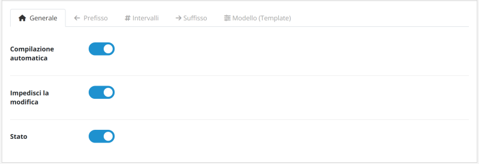
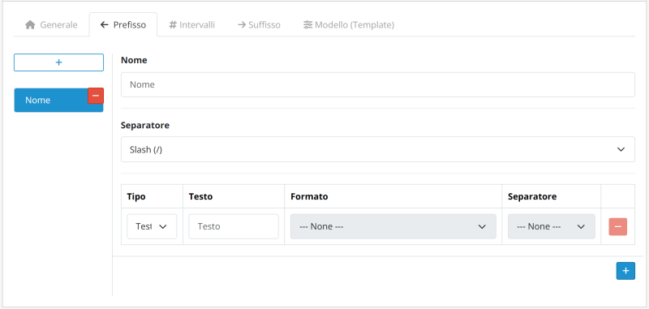
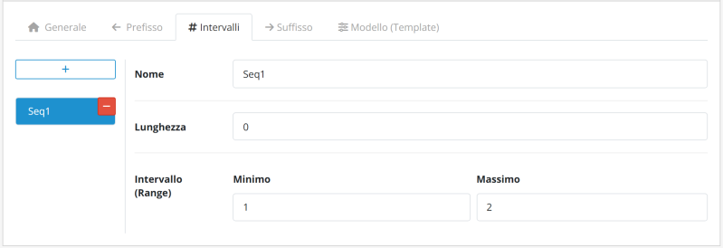
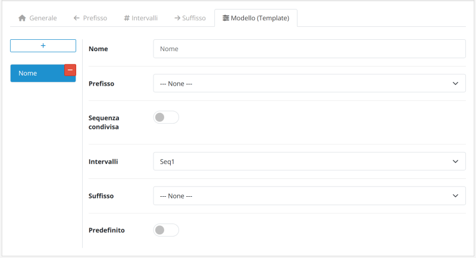

# Model Number Generator for OpenCart 3.x / 4.x

[English](README.md) | [Português (BR)](README.pt-br.md) | [Português (PT)](README.pt-pt.md) | [Español](README.es-es.md) | [Français](README.fr-fr.md) | [Italiano](README.it-it.md)

Documentazione dell’estensione Model Number Generator per OpenCart 3.x / 4.x. Genera automaticamente numeri modello strutturati per i prodotti. Disponibile nelle versioni Free e Pro. Con licenza GPL-3.0.

---

## Informazioni sul modulo

### Panoramica

Elimina il lavoro manuale e ripetitivo nella creazione dei codici identificativi dei prodotti.

Il modulo garantisce identificativi **univoci e standardizzati** attraverso un sistema intelligente di template. Questa soluzione consente di ridurre gli errori umani e i duplicati, creando una struttura logica e scalabile per un migliore controllo dell'inventario.

#### Requisiti

Assicurati di disporre dei permessi per accedere a:

- Extension Installer & Manager
- Product Catalog

#### Confronto delle versioni

| Funzionalità | Free | Pro |
|---|:---:|:---:|
| Blocco del campo Model | ❌ | ✅ |
| Template | Solo 1 | Illimitati |
| Intervalli numerici | Solo 1 | Illimitati |
| Prefissi | ❌ | Illimitati |
| Suffissi | ❌ | Illimitati |

---

### Funzionalità principali

| Funzionalità | Descrizione |
|:---|:---|
| **Compilazione automatica intelligente** | Il sistema identifica il template predefinito e compila automaticamente il campo **Model** quando si apre un nuovo modulo, facendo risparmiare tempo e clic. |
| **Sicurezza e unicità** | Garantisce un **identificativo univoco** per ogni prodotto, impedendo numeri duplicati, e può bloccare il campo **Model** per evitare modifiche manuali e ridurre gli errori umani. |
| **Elaborazione retroattiva** | Standardizza in modo sicuro i prodotti esistenti del negozio. Il modulo genera e applica i numeri modello ai prodotti attuali. |
| **Template dinamici** | Combina prefissi, intervalli e suffissi per creare regole distinte per reparto o categoria di prodotto. |
| **Interfaccia multilingue** | Interfaccia intuitiva con traduzioni native disponibili in inglese (EN), portoghese (PT), francese (FR), spagnolo (ES) e italiano (IT). |
| **Scalabilità completa** | Gestisci più regole contemporaneamente senza perdita di prestazioni nei database di grandi dimensioni. |

---

## Struttura del numero modello

La generazione dei codici è modulare e flessibile, suddivisa in tre componenti che garantiscono completa tracciabilità e unicità.

**Esempio di struttura:**

`ABC-XYZ-0001-ASD-QWE`

| Componente | Tipo | Esempio |
|---|---|---|
| **Prefisso** | Identificatore macro | `ABC-XYZ-` |
| **Sequenziale** | Nucleo numerico | `0001` |
| **Suffisso** | Attributi finali | `-ASD-QWE` |

### Prefissi

Identificatori macro che precedono il numero sequenziale (ad esempio, `ABC-XYZ-`).

- **Modulare**: Suddiviso in più blocchi.
- **Scalabile**: Aggiungi tutti i blocchi che desideri.
- **Opzionale**: Utilizzalo solo quando necessario.
- **Collegamento**: Richiede un separatore prima del numero sequenziale.

### Intervallo numerico

Il nucleo sequenziale obbligatorio (ad esempio, `0001`) che garantisce l'unicità.

- **Riempimento con zeri**: Aggiunge zeri iniziali fino a raggiungere la lunghezza configurata.
- **Variabile**: Lunghezza delle cifre personalizzabile.
- **Intervalli**: Regole e intervalli specifici per categoria.

### Suffissi

Attributi finali utilizzati per dettagliare versioni o stati (ad esempio, `-ASD-QWE`).

- **Modulare**: Suddiviso in più blocchi.
- **Scalabile**: Aggiungi tutti i blocchi che desideri.
- **Opzionale**: Utilizzalo solo quando necessario.
- **Collegamento**: Richiede un separatore prima del numero sequenziale.

---

### Attenzione: sensibilità ai separatori

Il sistema elabora letteralmente ogni carattere, collegando l'intervallo numerico alla combinazione univoca di prefissi, suffissi e separatori. **Qualsiasi modifica — come sostituire un trattino (`-`) con una barra (`/`) — definisce una nuova identità**, riavviando automaticamente la sequenza numerica per quello specifico identificatore.

- **Schema di riferimento**: `ABC-XYZ-0001-ASD-QWE`
- **Schema differente**: `ABC/XYZ-0001-ASD-QWE` *(La barra modifica il prefisso; il conteggio riparte per questo nuovo gruppo.)*

---

### Consiglio di standardizzazione

Per mantenere la leggibilità su etichette e report, utilizza acronimi brevi per rappresentare categorie o marchi.

- **Consigliato**: `HW-MEM-DDR4-001` *(Hardware - Memory - DDR4)*
- **Da evitare**: `HARDWARE-MEMORY-DDR4-001`

---

## Installazione

Segui la procedura seguente per applicare la numerazione automatica ai tuoi prodotti:

1. **Download**: Scarica il modulo ufficiale direttamente dall'[OpenCart Marketplace](https://www.opencart.com/index.php?route=marketplace/extension&filter_member=Rodrigoabr).
2. **Caricamento**: Nel pannello di amministrazione del negozio, vai su **Extensions > Installer**, fai clic su **Upload** e seleziona il file scaricato.
3. **Attivazione**: Individua il modulo nell'elenco delle estensioni e fai clic sull'icona **Install** per attivarlo.

> **Suggerimento tecnico**: Dopo l'attivazione, ricorda di andare su **Extensions > Modifications** e fare clic sul pulsante **Refresh** (icona blu) per svuotare la cache del sistema.

---

## Accesso alle impostazioni

Dopo l'installazione, segui questa procedura per configurare l'automazione:

1. Vai su **Extensions > Extensions** nel menu laterale.
2. Seleziona il tipo di estensione **Modules**.
3. Fai clic su **Edit** per aprire il pannello di configurazione.

---

### 1. Impostazioni generali

| Parametro | Funzione |
|---|---|
| **Compilazione automatica** | Genera immediatamente il template durante la creazione dei prodotti. |
| **Impedisci modifica** | Blocca il campo **Model** per impedire modifiche manuali. |
| **Stato** | Abilita o disabilita il modulo. |

---

### 2. Prefisso e suffisso

Queste schede consentono di comporre gli elementi testuali o di data che circondano il numero sequenziale.

#### Impostazioni del gruppo

| Parametro | Funzione |
|---|---|
| **Nome** | Identificazione interna (ad esempio, Electronics, Apparel). |
| **Separatore** | Carattere che collega questo gruppo al numero sequenziale. |

#### Composizione degli elementi

| Parametro | Descrizione |
|---|---|
| **Tipo** | Definisce se l'elemento sarà **Fixed Text** o una **Dynamic Date**. |
| **Contenuto (testo)** | Valore testuale da visualizzare (ad esempio, `PROD`). |
| **Formato (data)** | Formato della data desiderato (ad esempio, anno a 2 cifre + mese). |
| **Separatore** | Carattere che collega questo elemento a quello successivo all'interno dello stesso gruppo. |

> **Suggerimento**: Puoi aggiungere più elementi per creare prefissi complessi, come `YEAR-CATEGORY-`.

---

### 3. Intervallo sequenziale

| Parametro | Descrizione |
|---|---|
| **Nome** | Identificazione interna (ad esempio, General Count, Batch 2024). |
| **Lunghezza** | Definisce il numero minimo di cifre mediante il riempimento con zeri (ad esempio, una lunghezza di 4 trasforma `1` in `0001`). |
| **Min. / Max.** | Definisce il punto iniziale e il limite finale del conteggio. |

> **Suggerimento**: Se lavori con varianti (come colore o taglia), utilizza l'opzione **Shared Sequence** nella scheda **Template** per mantenere un'unica sequenza per tutti i prodotti.

---

### 4. Template

Il Template è il punto in cui vengono "unite" le impostazioni precedenti.

| Parametro | Descrizione |
|---|---|
| **Nome** | Identificazione interna (ad esempio, Mouse, Keyboard, A4 Sheets). |
| **Prefisso** | Collega al gruppo **Prefix** configurato. |
| **Shared Sequence** | Consente a diverse varianti di prodotto di condividere la stessa sequenza numerica. |
| **Intervallo** | Collega alla regola **Sequential Interval** configurata. |
| **Suffisso** | Collega al gruppo **Suffix** configurato. |
| **Predefinito** | Imposta il template come principale per l'**auto-fill**. |

> **Suggerimento sul flusso di lavoro**: Assicurati che i gruppi Prefix, Interval e Suffix siano già stati creati prima di completare questo passaggio.

---

### Sequenza condivisa

L'opzione **Shared Sequence** consente a diverse varianti di un prodotto (come colore, taglia o versione) di condividere la **stessa sequenza numerica**, anche se hanno suffissi differenti.

Quando è abilitata, il sistema ignora il suffisso durante il calcolo del numero disponibile successivo e considera solo il **prefisso**.

- **Prefisso**: `TSHIRT-`
- **Numero**: `001`
- **Suffisso**: `-WHT` / `-BLK`

#### Confronto del comportamento

| Modalità | Comportamento | Esempio di risultato |
|---|---|---|
| **Disabilitata** | Ogni suffisso ha una propria sequenza | `TSHIRT-001-WHT` `TSHIRT-002-WHT` `TSHIRT-001-BLK` `TSHIRT-002-BLK` |
| **Abilitata** | Sequenza unificata per tutte le varianti in base al prefisso | `TSHIRT-001-WHT` `TSHIRT-002-WHT` `TSHIRT-003-BLK` `TSHIRT-004-BLK` |

- **Quando utilizzarla**: Varianti di colore, taglia e versioni dei prodotti.
- **Importante**: Il numero deve trovarsi immediatamente dopo il prefisso. Strutture differenti possono impedire la corretta identificazione della sequenza.

---

## Generazione dei numeri

Segui la procedura seguente per applicare la numerazione automatica ai tuoi prodotti:

1. **Navigazione**: Nel menu laterale, vai su **Catalog > Products**.
2. **Accesso**: Fai clic su **Edit** sul prodotto oppure sul pulsante **Add New**.
3. **Posizione**: Vai alla scheda **Data** e individua il campo **Model** nel modulo.
4. **Genera numero**: Seleziona il template e fai clic sul pulsante **Generate**. Il campo **Model** verrà compilato.

> **Suggerimento pratico**: Quando selezioni un template non predefinito e attivi l'opzione **Set as default**, il sistema salverà automaticamente la tua scelta durante la generazione del numero.

---

## Disinstallazione

Segui i passaggi seguenti per una disinstallazione pulita e sicura:

1. **Disinstalla**: Vai su **Extensions > Extensions**, filtra per **Modules**, individua il modulo e fai clic su **Uninstall**.
2. **Elimina**: Individua il modulo nell'elenco delle estensioni installate e fai clic sull'icona **Delete**.

> **Cosa succede ai dati?**: La disinstallazione rimuove le impostazioni e i file del modulo. Tuttavia, i **numeri modello già generati** per i tuoi prodotti rimangono memorizzati nel database per evitare la perdita di integrità dei tuoi dati.

---

## Ti piace il modulo?

Se il modulo ti sta aiutando a ottimizzare il tuo catalogo, considera di offrire un caffè all'autore. Questo contribuisce allo sviluppo continuo, alla manutenzione e agli aggiornamenti futuri.

---

### Supporto e licenza

Ricevi assistenza tramite la pagina ufficiale del Marketplace: [Ottieni supporto](https://www.opencart.com/index.php?route=marketplace/extension&filter_member=Rodrigoabr).

---

## Informazioni sulla licenza

Questa estensione (versioni Free e Pro) è distribuita con la **GNU General Public License v3.0 (GPL-3.0)**.

- L'utilizzo e la modifica del software devono rispettare i termini stabiliti dalla licenza GPL-3.0.
- Il supporto tecnico e gli aggiornamenti sono forniti esclusivamente agli acquirenti originali tramite l'OpenCart Marketplace ufficiale.
- Per tutti i dettagli sulla licenza, consulta il [file LICENSE](https://github.com/ab-rodrigo/model-number-generator-docs/blob/main/LICENSE) incluso in questo repository oppure visita la pagina ufficiale della [GNU General Public License v3.0](https://www.gnu.org/licenses/gpl-3.0.html).

---

© 2026 **Rodrigoab** · [OpenCart Extensions](https://www.opencart.com/index.php?route=marketplace/extension&filter_member=Rodrigoabr)