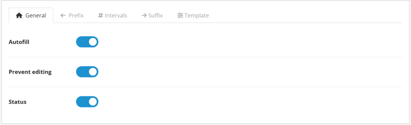
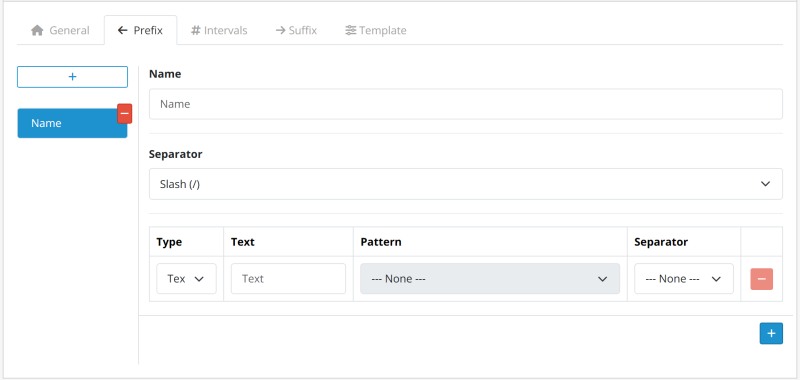
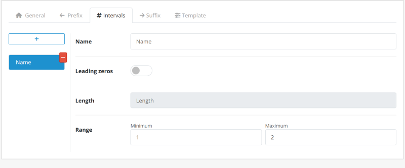
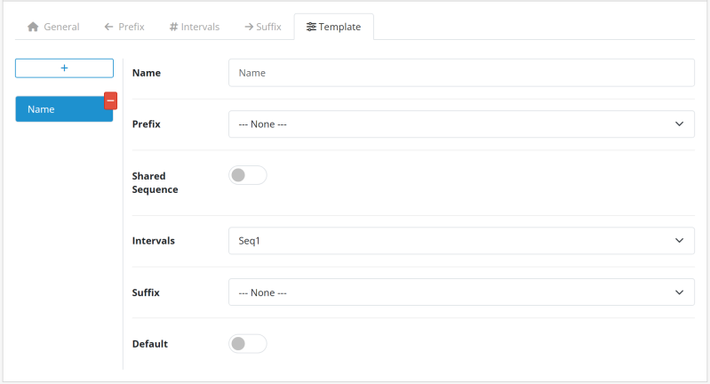
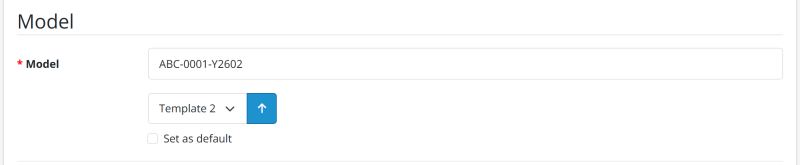

# Gerador de Número de Modelo para OpenCart 3.x / 4.x

[English](README.md) | [Português (BR)](README.pt-br.md) | [Português (PT)](README.pt-pt.md) | [Español](README.es-es.md) | [Français](README.fr-fr.md) | [Italiano](README.it-it.md)

Documentação oficial da extensão Gerador de Número de Modelo para OpenCart 3.x / 4.x. Gere automaticamente números de modelo de produtos estruturados. Disponível nas versões Gratuita e Pro. Licenciado sob GPL-3.0.

---

## Bem-vindo

Aprenda a instalar, configurar e automatizar a padronização dos números de modelo dos seus produtos.

* **Autor**: Rodrigo Barbosa (Rodrigoab)
* **Licença**: Licença Pública Geral GNU v3.0 (GPL-3.0)
* **Versões compatíveis do OpenCart**: 3.x / 4.x
* **Página oficial da extensão**: [OpenCart Marketplace](https://www.opencart.com/index.php?route=marketplace/extension&filter_member=Rodrigoabr)

---

## Sobre o Módulo

### Visão Geral

Elimine o trabalho manual e repetitivo na criação de códigos de identificação.

O módulo garante identificadores **únicos e padronizados** por meio de um sistema inteligente de Modelos (Templates). Com esta solução, você erradica erros humanos e duplicidades, estabelecendo uma estrutura lógica e escalável para o controle total do seu estoque.

#### Requisitos

Certifique-se de ter permissões para:

- Instalador e Gerenciador de Extensões
- Catálogo de Produtos

#### Comparativo de Versões

| Recurso | Gratuita | Pro |
|---|:---:|:---:|
| Bloquear campo Modelo | ❌ | ✅ |
| Modelos (Templates) | Apenas 1 | Ilimitados |
| Intervalos Numéricos | Apenas 1 | Ilimitados |
| Prefixos | ❌ | Ilimitados |
| Sufixos | ❌ | Ilimitados |

---

### Principais Recursos

- **Preenchimento automático inteligente**: O sistema identifica o modelo padrão e preenche automaticamente o campo **Modelo** ao abrir um novo formulário, economizando tempo e cliques.
- **Segurança e Unicidade**: Garante uma **identidade única** para cada produto, evitando números duplicados, e pode bloquear o campo **Modelo** contra edição manual para eliminar erros humanos.
- **Processamento Retroativo**: Padronize os itens existentes da loja com segurança. O módulo gera e aplica números de modelo aos seus produtos atuais de forma segura.
- **Modelos Dinâmicos**: Combine prefixos, intervalos e sufixos para criar regras distintas por departamento ou categoria de produto.
- **Interface Multi-idioma**: Interface intuitiva com traduções nativas disponíveis em inglês (EN), português (PT), francês (FR), espanhol (ES) e italiano (IT).
- **Escalabilidade Total**: Gerencie múltiplas regras simultaneamente sem perda de desempenho em grandes bancos de dados.

---

### Suporte e Licença

- **Suporte**: Obtenha ajuda através da página oficial no marketplace: [Obter Suporte](https://www.opencart.com/index.php?route=marketplace/extension&filter_member=Rodrigoabr).
- **Licença**: Software distribuído sob os termos da [Licença Pública Geral GNU v3.0 (GPL v3.0)](https://www.gnu.org/licenses/gpl-3.0.html).

---

## Estrutura do Número de Modelo

A geração do código é modular e flexível, dividida em três componentes que garantem rastreabilidade total e unicidade.

**Exemplo de estrutura:**

`ABC-XYZ-0001-ASD-QWE`

| Componente | Tipo | Exemplo |
|---|---|---|
| **Prefixo** | Macroidentificador | `ABC-XYZ-` |
| **Sequencial** | Núcleo Numérico | `0001` |
| **Sufixo** | Atributos Finais | `-ASD-QWE` |

### Prefixos

Macroidentificadores que antecedem o número sequencial (ex.: `ABC-XYZ-`).

- **Modular**: Segmentado em múltiplos blocos.
- **Escalável**: Adicione quantos blocos desejar.
- **Opcional**: Utilize apenas quando necessário.
- **Conexão**: Requer um separador antes do número.

### Intervalo Numérico

O núcleo sequencial obrigatório (ex.: `0001`) que garante a unicidade.

- **Preenchimento**: Preenchimento com zeros alinhado à esquerda.
- **Variável**: Comprimento de dígitos customizável.
- **Intervalos**: Regras e intervalos específicos por categoria.

### Sufixos

Atributos finais para detalhar versões ou status (ex.: `-ASD-QWE`).

- **Modular**: Segmentado em múltiplos blocos.
- **Escalável**: Adicione quantos blocos desejar.
- **Opcional**: Utilize apenas quando necessário.
- **Conexão**: Requer um separador antes do número.

---

### Atenção: Sensibilidade ao Separador

O sistema processa cada caractere literalmente, vinculando o intervalo numérico à combinação única de prefixos, sufixos e separadores. **Qualquer alteração — como trocar um hífen (`-`) por uma barra (`/`) — define uma nova identidade**, reiniciando automaticamente a sequência numérica para aquele identificador específico.

- **Padrão de referência**: `ABC-XYZ-0001-ASD-QWE`
- **Padrão diferente**: `ABC/XYZ-0001-ASD-QWE` *(A barra altera o prefixo; a contagem recomeça para este novo grupo)*

---

### Dica de Padronização

Para manter a legibilidade em etiquetas e relatórios, utilize siglas curtas para representar categorias ou marcas.

- **Recomendado**: `HW-MEM-DDR4-001` *(Hardware - Memória - DDR4)*
- **Evite**: `HARDWARE-MEMORY-DDR4-001`

---

## Instalação

Siga o fluxo de trabalho abaixo para aplicar a numeração automática aos seus produtos:

1. **Download**: Obtenha o módulo oficial diretamente no [OpenCart Marketplace](https://www.opencart.com/index.php?route=marketplace/extension&filter_member=Rodrigoabr).
2. **Envio**: No painel administrativo da sua loja, acesse **Extensões > Instalador**, clique em **Enviar** e selecione o arquivo baixado.
3. **Ativação**: Localize o módulo na lista de extensões e clique no ícone **Instalar** para ativá-lo.

> **Dica Técnica**: Após a ativação, lembre-se de ir em **Extensões > Modificações** e clicar no botão **Atualizar** (ícone azul) para limpar o cache do sistema.

---

## Acessando as Configurações

Após a instalação, siga este fluxo de trabalho para configurar sua automação:

1. Acesse **Extensões > Extensões** no menu lateral.
2. Selecione o tipo de extensão **Módulos**.
3. Clique em **Editar** para abrir o painel de configuração.

---

### 1. Configurações Gerais

| Parâmetro | Função |
|---|---|
| **Preenchimento automático** | Gera o modelo instantaneamente ao criar produtos. |
| **Impedir edição** | Bloqueia o campo **Modelo** para evitar alterações manuais. |
| **Status** | Ativa ou desativa o módulo. |

---

### 2. Prefixo e Sufixo

Estas abas permitem compor os elementos de texto ou data que envolvem o número sequencial.

#### Configurações do Grupo

| Parâmetro | Função |
|---|---|
| **Nome** | Identificação interna (ex.: Eletrônicos, Vestuário). |
| **Separador** | Caractere que une este grupo ao número sequencial. |

#### Composição dos Elementos

| Parâmetro | Descrição |
|---|---|
| **Tipo** | Define se o elemento será **Texto Fixo** ou uma **Data Dinâmica**. |
| **Conteúdo (Texto)** | O valor textual a ser exibido (ex.: `PROD`). |
| **Formato (Data)** | O padrão de data desejado (ex.: ano com 2 dígitos + mês). |
| **Separador** | Caractere que une este elemento ao próximo dentro do mesmo grupo. |

> **Dica**: Você pode adicionar múltiplos elementos para criar prefixos complexos, como `ANO-CATEGORIA-`.

---

### 3. Intervalo Sequencial

| Parâmetro | Descrição |
|---|---|
| **Nome** | Identificação interna (ex.: Contagem Geral, Lote 2024). |
| **Comprimento** | Define o número mínimo de dígitos preenchendo com zeros (ex.: comprimento 4 transforma "1" em "0001"). |
| **Mín / Máx** | Define o ponto inicial e o limite final da contagem. |

> **Dica**: Se você trabalha com variações (como cor ou tamanho), utilize a opção **Sequência Compartilhada** na aba **Modelo** para manter uma única sequência em todos os produtos.

---

### 4. Modelo (Template)

O Modelo é onde você "conecta" as configurações anteriores.

| Parâmetro | Descrição |
|---|---|
| **Nome** | Identificação interna (ex.: Mouse, Teclado, Folhas A4). |
| **Prefixo** | Vincula ao grupo de **Prefixo** configurado. |
| **Sequência Compartilhada** | Permite que diferentes variações do produto compartilhem a mesma sequência numérica. |
| **Intervalo** | Vincula à regra de **Numeração Sequencial**. |
| **Sufixo** | Vincula ao grupo de **Sufixo** configurado. |
| **Padrão** | Define o modelo como principal para o **preenchimento automático**. |

> **Dica de Fluxo de Trabalho**: Certifique-se de que os grupos de Prefixo, Intervalo e Sufixo já foram criados antes de finalizar esta etapa.

---

### Sequência Compartilhada

A opção **Sequência Compartilhada** permite que diferentes variações de um produto (como cor, tamanho ou versão) compartilhem a **mesma sequência numérica**, mesmo que possuam sufixos distintos.

Quando ativada, o sistema ignora o sufixo ao calcular o próximo número disponível e considera apenas o **prefixo**.

- **Prefixo**: `CAMISA-`
- **Número**: `001`
- **Sufixo**: `-BRA` / `-PRE`

#### Comparativo de Comportamento

| Modo | Comportamento | Exemplo de Resultado |
|---|---|---|
| **Desativado** | Cada sufixo possui sua própria sequência | `CAMISA-001-BRA` `CAMISA-002-BRA` `CAMISA-001-PRE` `CAMISA-002-PRE` |
| **Ativado** | Sequência unificada entre todas as variações por prefixo | `CAMISA-001-BRA` `CAMISA-002-BRA` `CAMISA-003-PRE` `CAMISA-004-PRE` |

- **Quando utilizar**: Variações de cor, variações de tamanho e versões de produto.
- **Importante**: O número deve estar imediatamente após o prefixo. Estruturas diferentes podem impedir a identificação correta da sequência.

---

## Gerando Números

Siga o fluxo de trabalho abaixo para aplicar a numeração automática aos seus produtos:

1. **Navegação**: No menu lateral, acesse **Catálogo > Produtos**.
2. **Acesso**: Clique em **Editar** no produto ou no botão **Adicionar Novo**.
3. **Localização**: Acesse a aba **Dados** e localize o campo **Modelo** no formulário.
4. **Gerar Número**: Selecione o modelo e clique no botão **Gerar**. O campo **Modelo** será preenchido.

> **Dica de Praticidade**: Ao selecionar um modelo diferente do padrão e marcar a opção **Definir como padrão**, o sistema salvará automaticamente sua escolha ao gerar o número.

---

## Desinstalação

Siga os passos abaixo para uma desinstalação limpa e segura:

1. **Desativar**: Acesse **Extensões > Extensões**, filtre por **Módulos**, localize o módulo e clique em **Desinstalar**.
2. **Desinstalar**: Localize o módulo na lista de extensões instaladas e clique no ícone **Desinstalar**.
3. **Excluir**: Ainda na lista de extensões instaladas, clique em **Excluir**.

> **O que acontece com os dados?**: A desinstalacão remove as configurações e arquivos do módulo. No entanto, os **números de modelo já gerados** para seus produtos permanecem armazenados no banco de dados para evitar a perda de integridade dos seus registros.

---

## Gostou do módulo?

Se o módulo está facilitando o seu dia e otimizando o seu catálogo, considere pagar um café para o autor. Isso ajuda a manter o código limpo, o suporte rápido e fornece a cafeína necessária para futuras atualizações!

---

## Informações sobre a Licença

Esta extensão (versões Gratuita e Pro) é licenciada sob a **Licença Pública Geral GNU v3.0 (GPL-3.0)**.

- O uso e a modificação do software devem estar em conformidade com os termos estabelecidos pela licença GPL-3.0.
- Suporte técnico e atualizações são fornecidos exclusivamente aos compradores originais através do OpenCart Marketplace oficial.
- Para obter todos os detalhes da licença, consulte o [arquivo LICENSE](https://github.com/ab-rodrigo/model-number-generator-docs/blob/main/LICENSE) incluído neste repositório ou visite a página oficial da [Licença Pública Geral GNU v3.0](https://www.gnu.org/licenses/gpl-3.0.html).

---

© 2026 **Rodrigoab** · [OpenCart Extensions](https://www.opencart.com/index.php?route=marketplace/extension&filter_member=Rodrigoabr)