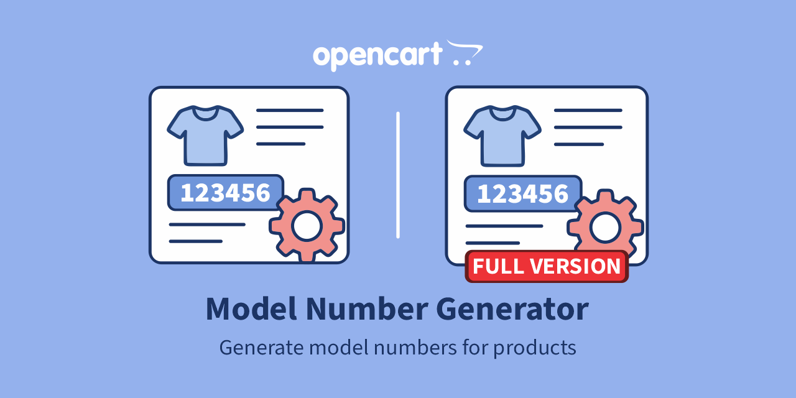
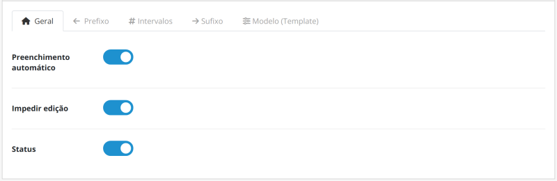
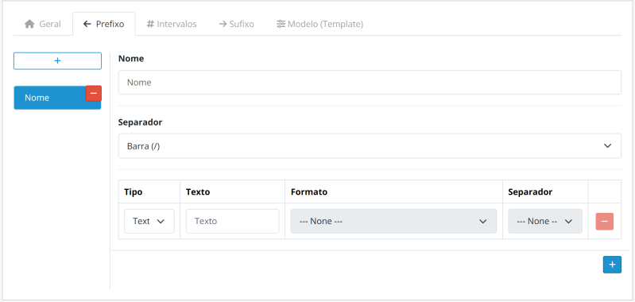
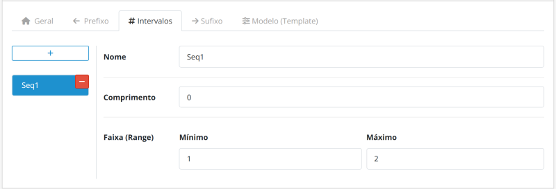
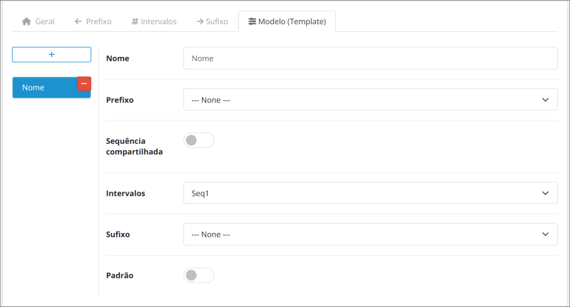
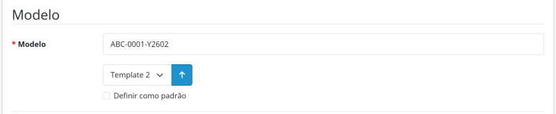

# Model Number Generator for OpenCart 3.x / 4.x

[English](README.md) | [Português (BR)](README.pt-br.md) | [Português (PT)](README.pt-pt.md) | [Español](README.es-es.md) | [Français](README.fr-fr.md) | [Italiano](README.it-it.md)

Documentação da extensão Model Number Generator para OpenCart 3.x / 4.x. Gere automaticamente números de modelo estruturados para produtos. Disponível nas versões Free e Pro. Licenciado sob a GPL-3.0.

---

## Sobre o módulo

### Visão geral

Elimine o trabalho manual e repetitivo na criação de códigos de identificação de produtos.

O módulo garante identificadores **únicos e normalizados** através de um sistema inteligente de Templates. Com esta solução, pode reduzir os erros humanos e as duplicações, estabelecendo uma estrutura lógica e escalável para um melhor controlo do inventário.

#### Requisitos

Certifique-se de que possui permissões para aceder a:

- Extension Installer & Manager
- Product Catalog

#### Comparação de versões

| Funcionalidade | Free | Pro |
|---|:---:|:---:|
| Bloquear campo Model | ❌ | ✅ |
| Templates | Apenas 1 | Ilimitados |
| Intervalos numéricos | Apenas 1 | Ilimitados |
| Prefixos | ❌ | Ilimitados |
| Sufixos | ❌ | Ilimitados |

---

### Principais funcionalidades

| Funcionalidade | Descrição |
|:---|:---|
| **Preenchimento automático inteligente** | O sistema identifica o template predefinido e preenche automaticamente o campo **Model** ao abrir um novo formulário, poupando tempo e cliques. |
| **Segurança e exclusividade** | Garante um **identificador único** para cada produto, evitando números duplicados, e pode bloquear o campo **Model** para impedir alterações manuais e eliminar erros humanos. |
| **Processamento retroativo** | Normalize com segurança os produtos existentes na loja. O módulo gera e aplica números de modelo aos seus produtos atuais. |
| **Templates dinâmicos** | Combine prefixos, intervalos e sufixos para criar regras distintas por departamento ou categoria de produto. |
| **Interface multilingue** | Interface intuitiva com traduções nativas disponíveis em inglês (EN), português (PT), francês (FR), espanhol (ES) e italiano (IT). |
| **Escalabilidade total** | Gira várias regras em simultâneo sem perda de desempenho em bases de dados de grandes dimensões. |

---

## Estrutura do número de modelo

A geração dos códigos é modular e flexível, dividida em três componentes que garantem uma rastreabilidade e exclusividade completas.

**Exemplo de estrutura:**

`ABC-XYZ-0001-ASD-QWE`

| Componente | Tipo | Exemplo |
|---|---|---|
| **Prefixo** | Identificador macro | `ABC-XYZ-` |
| **Sequencial** | Núcleo numérico | `0001` |
| **Sufixo** | Atributos finais | `-ASD-QWE` |

### Prefixos

Identificadores macro que precedem o número sequencial (por exemplo, `ABC-XYZ-`).

- **Modular**: Dividido em vários blocos.
- **Escalável**: Adicione tantos blocos quantos desejar.
- **Opcional**: Utilize apenas quando necessário.
- **Ligação**: Requer um separador antes do número sequencial.

### Intervalo numérico

O núcleo sequencial obrigatório (por exemplo, `0001`) que garante a exclusividade.

- **Preenchimento com zeros**: Adiciona zeros à esquerda até atingir o comprimento configurado.
- **Variável**: Comprimento dos dígitos personalizável.
- **Intervalos**: Regras e intervalos específicos por categoria.

### Sufixos

Atributos finais utilizados para detalhar versões ou estados (por exemplo, `-ASD-QWE`).

- **Modular**: Dividido em vários blocos.
- **Escalável**: Adicione tantos blocos quantos desejar.
- **Opcional**: Utilize apenas quando necessário.
- **Ligação**: Requer um separador antes do número sequencial.

---

### Atenção: sensibilidade aos separadores

O sistema processa cada carácter literalmente, associando o intervalo numérico à combinação exclusiva de prefixos, sufixos e separadores. **Qualquer alteração — como substituir um hífen (`-`) por uma barra (`/`) — define uma nova identidade**, reiniciando automaticamente a sequência numérica para esse identificador específico.

- **Padrão de referência**: `ABC-XYZ-0001-ASD-QWE`
- **Padrão diferente**: `ABC/XYZ-0001-ASD-QWE` *(A barra altera o prefixo; a contagem reinicia para este novo grupo.)*

---

### Dica de normalização

Para manter a legibilidade em etiquetas e relatórios, utilize siglas curtas para representar categorias ou marcas.

- **Recomendado**: `HW-MEM-DDR4-001` *(Hardware - Memory - DDR4)*
- **Evitar**: `HARDWARE-MEMORY-DDR4-001`

---

## Instalação

Siga o fluxo abaixo para aplicar a numeração automática aos seus produtos:

1. **Download**: Obtenha o módulo oficial diretamente no [OpenCart Marketplace](https://www.opencart.com/index.php?route=marketplace/extension&filter_member=Rodrigoabr).
2. **Upload**: No painel de administração da sua loja, aceda a **Extensions > Installer**, clique em **Upload** e selecione o ficheiro descarregado.
3. **Ativação**: Localize o módulo na lista de extensões e clique no ícone **Install** para o ativar.

> **Dica técnica**: Após a ativação, lembre-se de aceder a **Extensions > Modifications** e clicar no botão **Refresh** (ícone azul) para limpar a cache do sistema.

---

## Aceder às configurações

Após a instalação, siga este fluxo para configurar a automatização:

1. Aceda a **Extensions > Extensions** no menu lateral.
2. Selecione o tipo de extensão **Modules**.
3. Clique em **Edit** para abrir o painel de configuração.

---

### 1. Configurações gerais

| Parâmetro | Função |
|---|---|
| **Preenchimento automático** | Gera o template instantaneamente ao criar produtos. |
| **Impedir edição** | Bloqueia o campo **Model** para impedir alterações manuais. |
| **Estado** | Ativa ou desativa o módulo. |

---

### 2. Prefixo e sufixo

Estas abas permitem compor os elementos de texto ou data que envolvem o número sequencial.

#### Configurações do grupo

| Parâmetro | Função |
|---|---|
| **Nome** | Identificação interna (por exemplo, Electronics, Apparel). |
| **Separador** | Carácter que liga este grupo ao número sequencial. |

#### Composição dos elementos

| Parâmetro | Descrição |
|---|---|
| **Tipo** | Define se o elemento será **Fixed Text** ou uma **Dynamic Date**. |
| **Conteúdo (Texto)** | Valor textual a apresentar (por exemplo, `PROD`). |
| **Formato (Data)** | Formato de data pretendido (por exemplo, ano com 2 dígitos + mês). |
| **Separador** | Carácter que liga este elemento ao seguinte dentro do mesmo grupo. |

> **Dica**: Pode adicionar vários elementos para criar prefixos complexos, como `YEAR-CATEGORY-`.

---

### 3. Intervalo sequencial

| Parâmetro | Descrição |
|---|---|
| **Nome** | Identificação interna (por exemplo, General Count, Batch 2024). |
| **Comprimento** | Define o número mínimo de dígitos através do preenchimento com zeros (por exemplo, um comprimento de 4 transforma `1` em `0001`). |
| **Mín. / Máx.** | Define o ponto inicial e o limite final da contagem. |

> **Dica**: Se trabalhar com variantes (como cor ou tamanho), utilize a opção **Shared Sequence** no separador **Template** para manter uma única sequência para todos os produtos.

---

### 4. Template

O Template é onde as configurações anteriores são "ligadas".

| Parâmetro | Descrição |
|---|---|
| **Nome** | Identificação interna (por exemplo, Mouse, Keyboard, A4 Sheets). |
| **Prefixo** | Liga ao grupo **Prefix** configurado. |
| **Shared Sequence** | Permite que diferentes variantes de produto partilhem a mesma sequência numérica. |
| **Intervalo** | Liga à regra **Sequential Interval** configurada. |
| **Sufixo** | Liga ao grupo **Suffix** configurado. |
| **Predefinido** | Define o template como principal para o **auto-fill**. |

> **Dica de fluxo de trabalho**: Certifique-se de que os grupos Prefix, Interval e Suffix já foram criados antes de finalizar este passo.

---

### Sequência partilhada

A opção **Shared Sequence** permite que diferentes variantes de um produto (como cor, tamanho ou versão) partilhem a **mesma sequência numérica**, mesmo que tenham sufixos diferentes.

Quando ativada, o sistema ignora o sufixo ao calcular o próximo número disponível e considera apenas o **prefixo**.

- **Prefixo**: `TSHIRT-`
- **Número**: `001`
- **Sufixo**: `-WHT` / `-BLK`

#### Comparação de comportamento

| Modo | Comportamento | Exemplo de resultado |
|---|---|---|
| **Desativado** | Cada sufixo possui a sua própria sequência | `TSHIRT-001-WHT` `TSHIRT-002-WHT` `TSHIRT-001-BLK` `TSHIRT-002-BLK` |
| **Ativado** | Sequência unificada para todas as variantes por prefixo | `TSHIRT-001-WHT` `TSHIRT-002-WHT` `TSHIRT-003-BLK` `TSHIRT-004-BLK` |

- **Quando utilizar**: Variantes de cor, tamanho e versões de produtos.
- **Importante**: O número deve estar imediatamente após o prefixo. Estruturas diferentes podem impedir a identificação correta da sequência.

---

## Gerar números

Siga o fluxo abaixo para aplicar a numeração automática aos seus produtos:

1. **Navegação**: No menu lateral, aceda a **Catalog > Products**.
2. **Acesso**: Clique em **Edit** no produto ou no botão **Add New**.
3. **Localização**: Aceda ao separador **Data** e localize o campo **Model** no formulário.
4. **Gerar número**: Selecione o template e clique no botão **Generate**. O campo **Model** será preenchido.

> **Dica de conveniência**: Ao selecionar um template que não seja o predefinido e marcar a opção **Set as default**, o sistema guardará automaticamente a sua escolha ao gerar o número.

---

## Desinstalação

Siga os passos abaixo para realizar uma desinstalação limpa e segura:

1. **Desinstalar**: Aceda a **Extensions > Extensions**, filtre por **Modules**, localize o módulo e clique em **Uninstall**.
2. **Eliminar**: Localize o módulo na lista de extensões instaladas e clique no ícone **Delete**.

> **O que acontece aos dados?**: A desinstalação remove as configurações e os ficheiros do módulo. No entanto, os **números de modelo já gerados** para os seus produtos permanecem armazenados na base de dados para evitar a perda de integridade dos seus registos.

---

## Está a gostar do módulo?

Se o módulo está a ajudar a otimizar o seu catálogo, considere oferecer um café ao autor. Isto ajuda a manter o desenvolvimento, a manutenção e as futuras atualizações.

---

### Suporte e licença

Obtenha suporte através da página oficial do Marketplace: [Obter suporte](https://www.opencart.com/index.php?route=marketplace/extension&filter_member=Rodrigoabr).

---

## Informações sobre a licença

Esta extensão (versões Free e Pro) está licenciada ao abrigo da **GNU General Public License v3.0 (GPL-3.0)**.

- A utilização e modificação do software devem cumprir os termos estabelecidos pela licença GPL-3.0.
- O suporte técnico e as atualizações são fornecidos exclusivamente aos compradores originais através do OpenCart Marketplace oficial.
- Para consultar todos os detalhes da licença, consulte o [ficheiro LICENSE](https://github.com/ab-rodrigo/model-number-generator-docs/blob/main/LICENSE) incluído neste repositório ou visite a página oficial da [GNU General Public License v3.0](https://www.gnu.org/licenses/gpl-3.0.html).

---

© 2026 **Rodrigoab** · [OpenCart Extensions](https://www.opencart.com/index.php?route=marketplace/extension&filter_member=Rodrigoabr)